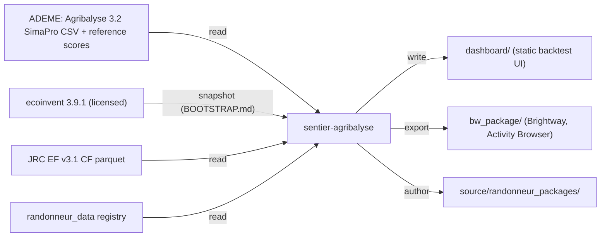
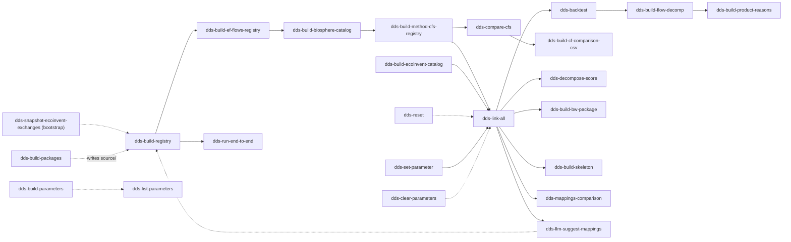

# sentier-agribalyse



Public, ecoinvent-EULA-clean adapter that brings Agribalyse 3.2 into Brightway 2.5.

## What it is

- Imports the ADEME Agribalyse 3.2 SimaPro CSV.
- Links it to ecoinvent 3.9.1 through a tiered `MappingRegistry`. Tiers are data, not code.
- Registers the 19 headline EF v3.1 LCIA methods and scores every product.
- Backtests every score against ADEME reference values in a static React dashboard.
- Exports the linked system as Brightway datapackages plus a standalone importer.

No proprietary ecoinvent data ships in git. The ecoinvent-derived files under `source/` and
`registry/method_cfs/` are gitignored and blocked by a pre-commit guard. Licensed users
regenerate them locally: see [BOOTSTRAP.md](BOOTSTRAP.md).

Deep dives (mapping tiers, registry contract, link sequence, solver notes) live in the DdS wiki
page `sentier-agribalyse`.



## Prerequisites

- Python 3.11+ and [uv](https://docs.astral.sh/uv/).
- `source/AGB32_final.CSV` (ADEME SimaPro export) and `source/harmonised-flows-simple.json.gz`. Both are local-only, not in git.
- An ecoinvent 3.9.1 licence to regenerate the gitignored `source/` files. Credentials go in `.env` as `ECOINVENT_USERNAME` and `ECOINVENT_PASSWORD`. Bootstrap only: see [BOOTSTRAP.md](BOOTSTRAP.md).
- The `pardiso` extra for scoring. scipy rejects the matrix's zero-diagonal placeholder activities as "exactly singular".

## Install

```bash
uv sync --extra pardiso
```

Add `--extra bw` for the Brightway export, `--extra test` for pytest, `--extra bootstrap` to snapshot ecoinvent, `--extra llm-api` for `--use-api`. pip works too: `pip install -e ".[pardiso]"`.

Activate the EULA guard once per clone:

```bash
pre-commit install
```

## Use

Run every script as `uv run <script>`.

| Command | What it does |
|---|---|
| `dds-snapshot-ecoinvent-exchanges` | Bootstrap only. Dump ecoinvent exchanges from a bw2data SQLite into `source/`. |
| `dds-build-registry` | Build `registry/*.parquet` from every `source/` artifact. Run first. |
| `dds-build-ef-flows-registry` | Write `registry/ef_flows.parquet`, the EF flow universe. |
| `dds-build-biosphere-catalog` | Write `registry/biosphere_catalog.parquet` from the biosphere snapshots. |
| `dds-build-method-cfs-registry` | Write `registry/method_cfs/`, per-method CF parquets plus index. |
| `dds-build-ecoinvent-catalog` | Write `registry/ecoinvent_catalog.parquet` from the activity snapshot. |
| `dds-build-parameters` | Write `registry/parameters.parquet` and `registry/exchange_formulas.parquet` from the CSV. |
| `dds-build-packages` | Author the randonneur datapackages in `source/randonneur_packages/` and the residuals review xlsx. |
| `dds-link-all` | Full link pipeline. Writes the scoring package and `dashboard/run_report.json`. |
| `dds-run-end-to-end` | Smoke test: link, register LCIA, score a small sample. |
| `dds-backtest` | Score every mapped product against ADEME. Writes `dashboard/backtest/` and `dashboard/backtest_pass1.csv`. |
| `dds-compare-cfs` | SimaPro-vs-registry per-flow CF comparison. Writes `dashboard/cf_comparison.csv`. |
| `dds-build-cf-comparison-csv` | Re-flatten `registry/cf_comparison_join.parquet` into `dashboard/cf_comparison.csv`. |
| `dds-build-flow-decomp` | Per-product flow-decomposition JSONs in `dashboard/decomp/`. |
| `dds-build-product-reasons` | LLM outlier notes in `dashboard/product_reasons.json`. Needs the `claude` binary or `--use-api`. |
| `dds-decompose-score` | Explain one `(product, method)` score: top biosphere-flow contributions. |
| `dds-build-bw-package` | Export `bw_package/`: bw_processing datapackages plus a standalone Brightway importer. Needs the `bw` extra. |
| `dds-build-skeleton` | Strip ecoinvent amounts from a scoring package into an AGB-only skeleton. |
| `dds-mappings-comparison` | Regenerate `to_review/mappings_comparison.xlsx` from the cached link. |
| `dds-llm-suggest-mappings` | LLM picks for residual unlinked flows. Appends accepted rows to the reviewed xlsx. |
| `dds-set-parameter` | Override a SimaPro input parameter, then relink and rescore. `--fast`, `--no-rescore`. |
| `dds-list-parameters` | Browse SimaPro parameter names, ranges, and active overrides. `--name-like`. |
| `dds-clear-parameters` | Remove overrides: all, `--name`, or `--product`. |
| `dds-reset` | Delete caches and overrides so the next link re-parses the CSV. `--keep-overrides`. |

Flags worth knowing:

- `--solver pardiso` on `dds-backtest`, `dds-run-end-to-end`, `dds-decompose-score`. Already the default on `dds-build-flow-decomp` and `dds-set-parameter`.
- `--skip-ecoinvent` on `dds-link-all` and `dds-run-end-to-end`; `--skip-linking` on `dds-run-end-to-end`.
- `--no-llm` on `dds-link-all` disables LLM overrides and the curated synonym fallback.

## Typical workflow

1. Licensed users, once: regenerate the ecoinvent-derived `source/` files per [BOOTSTRAP.md](BOOTSTRAP.md).
2. Build the registry: `uv run dds-build-registry`, then `dds-build-ef-flows-registry`, `dds-build-biosphere-catalog`, `dds-build-method-cfs-registry`, `dds-build-ecoinvent-catalog`.
3. Link: `uv run dds-link-all`.
4. Score: `uv run dds-backtest --solver pardiso`.
5. Dashboard data: `uv run dds-compare-cfs`, then `uv run dds-build-flow-decomp`.
6. Optional tooltips: `uv run dds-build-product-reasons`.
7. View: `python -m http.server 8000 --directory dashboard`, then open `http://localhost:8000/backtest_dashboard.html`.
8. Optional export: `uv run dds-build-bw-package` (needs the `bw` extra). `bw_package/` embeds ecoinvent data; it is gitignored and blocked by the guard.

After replacing the SimaPro CSV run `uv run dds-reset`, then repeat from step 3.

What-if on a parameter, no SimaPro needed:

```bash
uv run dds-set-parameter Packaging_Weight 0.03 --product EI3CQUNI000025017101234
```

## Layout

```
source/        inputs + the randonneur packages we publish (ecoinvent-derived files gitignored)
registry/      built mapping parquets, single source of mapping truth (gitignored, regenerable)
cache/         parquet caches, importer pickle, scoring packages (gitignored)
dashboard/     static React UI + backtest_pass1.csv (committed); other generated data gitignored
to_review/     human-review artifacts
unlinked/      residual unlinked exports
bw_package/    Brightway export (gitignored, EULA-guarded)
src/           the package, flat layout: cli/, registry/, matching/, transforms/, ef/, scoring/,
               reporting/, pipelines/, bw_export/, bw_import/, exports/, llm/
tests/         pytest suite: unit/, integration/, fixtures/
.githooks/     pre-commit ecoinvent EULA guard
BOOTSTRAP.md   how a licensed user regenerates the gitignored source/ files
```

## Licence

Code: MIT (`pyproject.toml`). ecoinvent data is licensed separately and never ships in this
repo; regenerated files stay local under the ecoinvent EULA.
